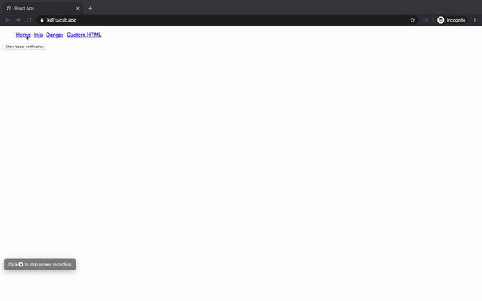

# Developer experience while building react-components

Manging consistency across applications and teams is always a challenge specailly in a large firm. Be it UX, design, code-styling, build tools, the list goes on. This is what largely consitutes the Developer Experience.

A good Developer Experience (DX) is when a developer can get their work done in an optimized manner, without being worried about things like bootstrapping an application, indentation standards, naming conventions..

Talking about the React ecosystem, it has taken care of the DX from the very beginning by its component style pattern, further increasing the DX by building tooling like the [`create-react-app`](https://github.com/facebook/create-react-app), etc. Then there are design systems like [cosmos](https://github.com/auth0/cosmos) which brings consistency to the way we make applications across different repositories using the same react components.

In this blog we will look at how to build a reusable notification system and avoid the common pitfalls, we would ahve picked up while ramping on React. Consider a notification/alert/toast popup component, as a component, it should have the ability to render whatever child components are passed to it and it should be able to close/hide itself on click of the close button (or even close or hide itself after a set timeout). In the simplest of designs the engineer would use a prop drilling pattern and pass an onClose function to the toast component which would be able to toggle the state in the parent component that hosts our notification piece.

This by design is not wrong, however, from a developer experience perspective why should the parent component host the function that would be responsible for hiding/closing the notification. This responsibility should be of the component itself. What makes the react-notifier highly reusable is the fact, that any other component using it does not have to worry about the state(hide/show or open/close) of the notification component, rather it exposes an add and remove method that takes care of the states for you. 

This traditionally is possible managing a global state using redux, however, in the spirit of embracing the latest react feature we would be using react hooks and the context API to achieve the same. Excited enough? Let's jump in!!


## Building a reusable notification system with react hooks and context API

The notification system is built with react and no external library. The toast notifications will be stackable, meaning we can have multiple notifications showing up at the same time, these will be capable of rendering a string or another react component within itself.

## Background

The following assumes that the reader has a thorough understanding of React and react hooks and will be providing only a brief on the required react hooks. For a detailed understanding of react-hooks please refer, [react hooks docs](https://reactjs.org/docs/hooks-intro.html).

We will be using the following hooks

- `useState`, this allows us to use the react state within functional components (this earlier used to be possible only in class-based components and functional components were used only as presentational components).

- `useContext`, this hook takes a context object as an input and returns the value passed in `Context.Provider`. React context API provides a way to pass the props/data in a component tree without having to pass the props/data to every child at every level (prop drilling)

Below is the syntax for the context API for reference

```javascript
const SampleContext = React.createContext(/*initialVAlue*/);

// wrap the parent component with the context provider
<SampleContext.Provider value={/*value*/}>
  .
  .
  .
  .
  /* n level child can access the provider value using SampleContext.Consumer */
  <SampleContext.Consumer>
    {value => /* Component with access to value object */}
  </SampleContext.Consumer>
</SampleContext.Provider>
```

- `useReducer`, this is a custom hook baked into react hooks, which provides a redux reducer like interface. The reducer takes an initial state and action object having type and a payload, based on the type the initial state is recreated (pure function) and returned. A dispatch function is used to trigger the reducer switch.

The usage below of the `useReducer` is copied from the react docs.

```javascript
// the reducer function that provides new state based on action.type
function todosReducer(state, action) {
  switch (action.type) {
    case 'add':
      return [
        ...state,
        {
          text: action.text,
          completed: false
        }
      ];
    // ... other actions ...
    default:
      return state;
  }
}

// the useReducer function keeps track of the state and returns the new state and a dispatcher function.
function useReducer(reducer, initialState) {
  const [state, setState] = useState(initialState);

  function dispatch(action) {
    const nextState = reducer(state, action);
    setState(nextState);
  }

  return [state, dispatch];
}

// Sample usage of the useReducer.
function Todos() {
  const [todos, dispatch] = useReducer(todosReducer, []);

  function handleAddClick(text) {
    dispatch({ type: 'add', text });
  }

  // ...
}
```

## Lets build

> Note: we will be using create-react-app to scaffold a basic react app, also please install the latest stable version of NodeJS.

Create a basic react app using the `create-react-app`.

```bash
$: npx create-react-app react-notifier
$: cd react-notifier
$: npm run start # this will start a development server at http://localhost:3000/
```

Now open the created project in your favorite code editor, and edit `src/App.js` to have

```javascript
// src/App.js
import React from 'react';
import './App.css';

function App() {
  return <div className="App">Hello</div>;
}

export default App;
```

Also edit `src/App.css` to have the below code.

```css
.App {
  text-align: left;
}
```

Next create a folder structure as below:


We call our notification component Toast.

### Lets create the Toast Component

This will be a simple component that takes an array and renders the same based on whether the element of the array is a function or an object

```javascript
// src/components/Toast

import React from 'react';

export default function Toast({ toast }) {
  // function to decide how to render the content of the toast
  function renderItem(content) {
    if (typeof content === 'function') {
      return content();
    } else {
      return <pre>{JSON.stringify(content, null, 2)}</pre>;
    }
  }
  return (
    <div className="toast">
      <div className="toast-container">
        {/* Displaying each element of the toast */}
        {toast.map(t => {
          return (
            <div
              className={`toast-container-item ${t.type ? t.type : ''}`}
              key={t.id}
            >
              <span role="img" aria-label="close toast" className="toast-close">
                &times;
              </span>
              {renderItem(t.content)}
            </div>
          );
        })}
      </div>
    </div>
  );
}
```

we will be using `.scss` for defining the CSS

> Note: Please run `npm install --save node-sass` to compile `.scss` files

```css
// styles/base.scss
// base colors
$black: #212121;
$white: #fff;
$gray: #e0e0e0;
$primaryBlue: #1652f0;
$hoverBlue: #154de0;
$red: #d9605a;
// fonts
$code: 'Oxygen Mono', monospace;

// styles/toast.scss
@import './base.scss';
.toast {
  position: fixed;
  top: 50px;
  right: 10px;
  width: 300px;
  max-height: 90vh;
  overflow-y: scroll;
  font-family: $code;
  .toast-container {
    display: flex;
    flex-direction: column;
    align-items: flex-start;
    .toast-container-item {
      border: $primaryBlue solid 1px;
      margin: 5px 0px;
      padding: 2px;
      border-radius: 4px;
      width: 100%;
      min-height: 100px;
      word-wrap: break-word;
      background-color: $black;
      box-shadow: 4px 4px 15px 2px rgba(black, 0.75);
      color: $white;
      transition: 0.2s;
      &:not(:first-child) {
        margin-top: -3rem;
      }
      // &:hover,
      // &:focus-within {
      //   transform: translateX(-2rem);
      // }
      &:hover ~ .toast-container-item,
      &:focus-within ~ .toast-container-item {
        transform: translateY(3rem);
      }

      &.info {
        border: $primaryBlue solid 1px;
        background-color: $hoverBlue;
      }
      &.danger {
        border: $red solid 1px;
        background-color: $red;
      }
      .toast-close {
        cursor: pointer;
        position: relative;
        top: 5px;
        font-size: 20px;
        font-weight: 800;
      }
    }
  }
}
```

We use `position: fixed;` along with the top and right attributes to have the toast notification appear from the top-right corner of the screen.

Subsequently, we use the `display: flex;` property in the `toast-container`, to have a flexible layout

To know more on flex please refer: [A complete guide to flexbox](https://css-tricks.com/snippets/css/a-guide-to-flexbox/)

Next, let us define our `ToastContext` so that we can trigger the component from anywhere in the application

```javascript
// contexts/ToastContext.js

import React, { createContext, useReducer, useContext } from 'react';
import { createPortal } from 'react-dom';
import Toast from '../components/Toast';
import '../styles/toast.scss';

export const ToastContext = createContext();

const initialState = [];

export const ADD = 'ADD';
export const REMOVE = 'REMOVE';
export const REMOVE_ALL = 'REMOVE_ALL';

export const toastReducer = (state, action) => {
  switch (action.type) {
    case ADD:
      return [
        ...state,
        {
          id: +new Date(),
          content: action.payload.content,
          type: action.payload.type
        }
      ];
    case REMOVE:
      return state.filter(t => t.id !== action.payload.id);
    case REMOVE_ALL:
      return initialState;
    default:
      return state;
  }
};

export const ToastProvider = props => {
  const [toast, toastDispatch] = useReducer(toastReducer, initialState);
  const toastData = { toast, toastDispatch };
  return (
    <ToastContext.Provider value={toastData}>
      {props.children}

      {createPortal(<Toast toast={toast} />, document.body)}
    </ToastContext.Provider>
  );
};

export const useToastContext = () => {
  return useContext(ToastContext);
};
```

Let's break down the above code.

We initialize an empty react context using `React.createContext();`, next we prepare the actions that would be required for the notification system, these can be put in separate files if the application becomes bigger and has a lot of actions (to remove conflicting actions),

```javascript
export const ADD = 'ADD';
export const REMOVE = 'REMOVE';
export const REMOVE_ALL = 'REMOVE_ALL';
```

Next is the reducer function that takes the initial state as an empty array and based on the action.type pushes to the array or removes while returning a new state.

We also provide an id to all new entries in toast array, this makes it easier to remove the said target toast/notification.

Next we create a Provider function which provides the value to the empty context created via, `<Context.Provider>`
We combine the returned newState and the dispatcher function from the useReducer hook and send these as values via context API.

We use the `React.createPortal` to render the toast component in the document.body, this provides easier/less conflicting styling and document flow.

Lastly, we expose the useContext (an easier to use version of `<Context.Consumer>`) hook via a custom hook.

Update the toast component to use the `useToastContext` hook so that it can have its own dispatcher to close the toast/notification from within the component

```javascript
// src/components/Toast.js
import React from 'react';

import { useToastContext, REMOVE } from '../contexts/ToastContext';

export default function Toast({ toast }) {
  const { toastDispatch } = useToastContext();
  function renderItem(content) {
    if (typeof content === 'function') {
      return content();
    } else {
      return <pre>{JSON.stringify(content, null, 2)}</pre>;
    }
  }
  return (
    <div className="toast">
      <div className="toast-container">
        {toast.map(t => {
          return (
            <div
              className={`toast-container-item ${t.type ? t.type : ''}`}
              key={t.id}
            >
              <span
                role="img"
                aria-label="close toast"
                className="toast-close"
                onClick={() =>
                  toastDispatch({ type: REMOVE, payload: { id: t.id } })
                }
              >
                &times;
              </span>
              {renderItem(t.content)}
            </div>
          );
        })}
      </div>
    </div>
  );
}
```

To see the above in action, let's make some basic routes and navigation using the `react-router-dom`.

```bash
$: npm install -s react-router-dom
```

Since the following will be made only to show the usage of the Toast Component, we will be defining the components for each route within `src/App.js` file.

Defining the home component

```javascript
export const Home = () => {
  const { toastDispatch } = useToastContext();
  return (
    <div>
      <button
        onClick={() =>
          toastDispatch({
            type: ADD,
            payload: {
              content: { sucess: 'OK', message: 'Hello World' }
            }
          })
        }
      >
        Show basic notification
      </button>
    </div>
  );
};
```

the above is a simple component that renders a button, the onClick of the button dispatches an action with `type: ADD` some content and optionally a type of `info` or `danger` this is used to render the background color of the toast/notification.

similarly we will define some other components just to show various types of toast components use cases.

the final `scr/App.js` file is below

```javascript
import React from 'react';
import { BrowserRouter as Router, Switch, Route, Link } from 'react-router-dom';
import './App.css';
import { useToastContext, ADD, REMOVE_ALL } from './contexts/ToastContext';

export const Home = () => {
  const { toastDispatch } = useToastContext();
  return (
    <div>
      <button
        onClick={() =>
          toastDispatch({
            type: ADD,
            payload: {
              content: { sucess: 'OK', message: 'Hello World' }
            }
          })
        }
      >
        Show basic notification
      </button>
    </div>
  );
};
export const Info = () => {
  const { toastDispatch } = useToastContext();
  return (
    <div>
      <button
        onClick={() =>
          toastDispatch({
            type: ADD,
            payload: {
              content: { sucess: 'OK', message: 'Info message' },
              type: 'info'
            }
          })
        }
      >
        Show Info notification
      </button>
    </div>
  );
};

export const Danger = () => {
  const { toastDispatch } = useToastContext();
  return (
    <div>
      <button
        onClick={() =>
          toastDispatch({
            type: ADD,
            payload: {
              content: { sucess: 'FAIL', message: 'Something nasty!' },
              type: 'danger'
            }
          })
        }
      >
        Show danger notification
      </button>
    </div>
  );
};

export const CutomHTML = () => {
  const { toastDispatch } = useToastContext();
  return (
    <div>
      <button
        onClick={() =>
          toastDispatch({
            type: ADD,
            payload: {
              content: () => {
                return (
                  <div>
                    <h4>Error</h4>
                    <p>Something nasty happened!!</p>
                  </div>
                );
              },
              type: 'danger'
            }
          })
        }
      >
        Show danger notification with custom HTML
      </button>
    </div>
  );
};

export default function App() {
  const { toast, toastDispatch } = useToastContext();
  function showClearAll() {
    if (toast.length) {
      return (
        <button
          onClick={() =>
            toastDispatch({
              type: REMOVE_ALL
            })
          }
        >
          Clear all notifications
        </button>
      );
    }
  }
  return (
    <div className="App">
      <Router>
        <ul>
          <li>
            <Link to="/">Home</Link>
          </li>
          <li>
            <Link to="/info">Info</Link>
          </li>
          <li>
            <Link to="/danger">Danger</Link>
          </li>
          <li>
            <Link to="/custom-html">Custom HTML</Link>
          </li>
        </ul>
        <Switch>
          <Route exact path="/">
            <Home />
          </Route>
          <Route exact path="/info">
            <Info />
          </Route>
          <Route exact path="/danger">
            <Danger />
          </Route>
          <Route exact path="/custom-html">
            <CutomHTML />
          </Route>
        </Switch>
      </Router>
      <br />
      {showClearAll()}
    </div>
  );
}
```

A working demo of the above can be found at [CodeSandbox link](https://kdl1u.csb.app/)

## Demo gif



## Wrap up

To sum up, think what all features of a component can be re-used and embed those to the component itself, rather than waiting for individual parent components to pass their own versions of this common functionality.

The above is one of the several ways to achieve a better DX while building components for your application or even your own design system. This plays a long way in you building scalable applications that your co-developers would love to work with.

Cheers! 
